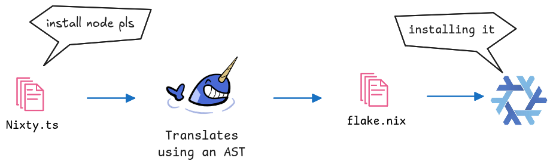

<p align="center">
    </img>
</p>
<p align="center"><b>Generate Nix Flakes using TypeScript</b></p>

-----


- [How it works](#how-it-works)
- [Installation](#installation)
- [Getting Started](#getting-started)
- [CLI](#cli)
- [API](#api)
- [More Examples](#more-examples)
- [Research](#research)

-----

[Nix ❄️](https://nixos.org) is known for its icy difficulty barrier 🥶. If only you could use Nix from a language you already know... oh wait, that's what this library does.

Nixty lets you describe and generate Nix flakes with a friendly TypeScript API:

```ts
import { Definition, DevShell, Nixpkgs, System } from "nixty-lib"

const SYSTEMS = [System.x86_64Linux, System.aarch64Darwin]

const NIX_PKGS = new Nixpkgs({ tag: "nixos-25.05" })

const dev = new DevShell({
    name: "dev",
    systems: SYSTEMS,
    packages: (system) => NIX_PKGS.getPackages(["nodejs_22", "shellcheck"], system),
    env: { GREETING: "Hi" },
    onEnter: `echo "$GREETING! Node.js and shellcheck are ready"`,
})

export default new Definition({
    description: "My app",
    nixpkgs: NIX_PKGS,
    devShells: [dev],
})
```

Run `nixty develop dev` and you're in a shell with Node.js and shellcheck.

### Capabilities
So far, Nixty lets you...

- Define inputs from different sources (GitHub, GitLab, tarballs, local files...)
- Define packages, dev shells and commands
- Import and interact with nix expresions from `.nix` files/flakes.
- A friendly CLI
- Typechecking!

If learning from examples is more your thing, look at [`examples/`](./examples/)

## How it works

> Nixty aims to be your everyday tool for managing your project's packages.

### What Nixty is

Nixty is a translator. You describe your project in TypeScript, Nixty writes the `flake.nix` for it, and
Nix does the actual work: downloading, building and installing.




1. You write a `nixty.ts` file that exports a [`Definition`](#definition).
2. `nixty generate` translates your definition on a `flake.nix`.
3. Nix reads that `flake.nix` and builds your packages or opens your shells.

The result is a plain `flake.nix`. You can read it, commit it, and anyone with Nix can use it, even
without Nixty.

### What Nixty is not

Nixty is not the Nix language written in TypeScript. Its API is a **rework** of it, based on
[a research on Nix's language usability](#research), so some Nix ideas look different.

If you already know Nix, expect to relearn a few names.

## Installation
1. Make sure you have [Nix](https://nixos.org/download/) installed.

2. Install Nixty
```bash
pnpm add -D nixty-lib   # Install nixty
pnpm exec nixty init    # Create boilerplate config
```
3. (Optional) Install the CLI Globally
```bash
pnpm install nixty-lib -g
```

**Nix users**
```bash
# Try it without installing anything
nix run github:DanielRasho/Nixty -- --help

# Install it (`nix profile install` on older Nix)
nix profile add github:DanielRasho/Nixty
```

This install the CLI, you still needs `nixty-lib` as a dev dependency on your `package.json`, so you can import its API.

## Getting Started

This tutorial builds a small project with a package, a dev shell and a command. You need
[Nix](https://nixos.org/download/), Node.js 22.18 or newer, and pnpm.

The commands below use `nixty`. If you didn't install it globally, write `pnpm exec nixty` instead.

### 1. Init the project

```bash
pnpm add -D nixty-lib   # Install nixty
pnpm exec nixty init    # Create boilerplate config
```

> [!IMPORTANT]
> **Nix only sees files that git tracks.** After creating a file, run `git add -A`, or Nix won't find it.

### 2. Say where things come from

Everything in Nixty starts from a [Path](#path): where something lives. Create `nixty.ts` with the two
this project uses:

```ts
import { Nixpkgs, Path, Source, System } from "nixty-lib"

// The machines your project works on. Keep yours in the list.
const SYSTEMS = [System.x86_64Linux, System.aarch64Darwin]

// Nixpkgs, Nix's package collection, from GitHub.
const NIX_PKGS = new Nixpkgs({ tag: "nixos-25.05" })

// Your own code: this folder.
const SRC = new Source(Path.fetchInternalPath("."))
```

### 3. Package a program

A [Derivation](#derivation) is a recipe to build a program. The first kind you can write is
a **package**: a program to install. Create `hello.sh`:

```bash
#!/usr/bin/env bash
cowsay "Hello, ${1:-world}!"
```

Add the package to `nixty.ts`, and export the project's `Definition`:

```ts
import { Definition, Nixpkgs, Package, Path, Source, System, nix } from "nixty-lib"

// ...

const hello = new Package({
    name: "hello",
    systems: SYSTEMS,
    definition: (system) => ({
        version: "1.0.0",
        src: SRC,
        deps: {
            atRuntime: NIX_PKGS.getPackages(["cowsay"], system),
        },
        // Nothing to compile: just copy the script. `out` is the folder the package is installed into.
        phases: (out) => ({
            install: nix`install -Dm755 hello.sh ${out}/bin/hello`,
        }),
    }),
})

export default new Definition({
    description: "My first Nixty project",
    nixpkgs: NIX_PKGS,
    packages: [hello],
})
```

Write the flake, let git see it, and run the program:

```bash
nixty generate
git add -A
nixty run hello Ana
```

`nixty build hello` builds it into
`./result/bin/hello` instead. Nix also wrote a `flake.lock`: it pins the exact version of nixpkgs, so
everyone gets the same tools.

`cowsay` is a derivation too: `getPackages` gives you nixpkgs' recipes. The `nix` before the install
command lets you put `out` inside a string (see [`nix` strings](#nix-strings)).

### 4. Add a dev shell

The second kind: a terminal with the tools you pick, your own package included.

```ts
import { Definition, DevShell, Nixpkgs, Package, Path, Source, System, nix } from "nixty-lib"

// ...

const dev = new DevShell({
    name: "dev",
    systems: SYSTEMS,
    packages: (system) => [hello.getDerivation(system), ...NIX_PKGS.getPackages(["nodejs_22"], system)],
    onEnter: `echo "Welcome to the dev shell!"`,
})

export default new Definition({
    description: "My first Nixty project",
    nixpkgs: NIX_PKGS,
    packages: [hello],
    devShells: [dev],
})
```

```bash
nixty develop dev
```

Inside the shell, `hello` and `node --version` work even if neither is installed on your machine. Every `nixty` command regenerates `flake.nix` first, so there's no need to run
`nixty generate` again.

### 5. Add a command

The third kind: a script that brings its own tools, like an npm script.

```ts
import { Command, Definition, DevShell, Nixpkgs, Package, Path, Source, System, nix } from "nixty-lib"

// ...

const moo = new Command({
    name: "moo",
    systems: SYSTEMS,
    packages: (system) => NIX_PKGS.getPackages(["cowsay"], system),
    command: `cowsay "Hello from Nixty"`,
})

export default new Definition({
    description: "My first Nixty project",
    nixpkgs: NIX_PKGS,
    packages: [hello],
    devShells: [dev],
    commands: [moo],
})
```

```bash
nixty command moo
```

You don't have cowsay installed: Nix gets it just for this command.

### 6. Share it

Commit `nixty.ts`, `flake.nix` and `flake.lock`. Whoever clones the project gets the same tools.
`nixty update` updates your programs versions to the newest possible.

You can check more on [`examples/`](./examples/). Happy coding!

<details>
<summary>The complete <code>nixty.ts</code></summary>

```ts
import { Command, Definition, DevShell, Nixpkgs, Package, Path, Source, System, nix } from "nixty-lib"

const SYSTEMS = [System.x86_64Linux, System.aarch64Darwin]

const NIX_PKGS = new Nixpkgs({ tag: "nixos-25.05" })

const SRC = new Source(Path.fetchInternalPath("."))

const hello = new Package({
    name: "hello",
    systems: SYSTEMS,
    definition: (system) => ({
        version: "1.0.0",
        src: SRC,
        deps: {
            atRuntime: NIX_PKGS.getPackages(["cowsay"], system),
        },
        phases: (out) => ({
            install: nix`install -Dm755 hello.sh ${out}/bin/hello`,
        }),
    }),
})

const dev = new DevShell({
    name: "dev",
    systems: SYSTEMS,
    packages: (system) => [hello.getDerivation(system), ...NIX_PKGS.getPackages(["nodejs_22"], system)],
    onEnter: `echo "Welcome to the dev shell!"`,
})

const moo = new Command({
    name: "moo",
    systems: SYSTEMS,
    packages: (system) => NIX_PKGS.getPackages(["cowsay"], system),
    command: `cowsay "Hello from Nixty"`,
})

export default new Definition({
    description: "My first Nixty project",
    nixpkgs: NIX_PKGS,
    packages: [hello],
    devShells: [dev],
    commands: [moo],
})
```

</details>

## CLI

Run `nixty` in your project folder, or in any folder inside it: it uses the nearest `nixty.ts`.

| Command | What it does |
|---|---|
| `nixty init` | Write a `nixty.ts` to start from in this folder |
| `nixty generate [file]` | Write `flake.nix` from `nixty.ts` (or from `file`) |
| `nixty develop <shell>` | Enter a dev shell |
| `nixty command <command> [args...]` | Run a command |
| `nixty run <package> [args...]` | Build a package and run its program |
| `nixty build <package>` | Build a package into `./result` |
| `nixty update [inputs...]` | Updates the version of your dependencies to the newer possible `flake.lock` |

`nixty --help` lists them, and `nixty <command> --help` explains one.

<details>
<summary><b>For Nix users: what each command runs</b></summary>

| nixty | nix |
|---|---|
| `nixty develop dev` | `nix develop .#devShells.<system>.dev` |
| `nixty build hello -L` | `nix build .#packages.<system>.hello -L` |
| `nixty run hello Ana` | `nix run .#packages.<system>.hello -- Ana` |
| `nixty command moo` | `nix run .#apps.<system>.moo` |
| `nixty update nixpkgs` | `nix flake update nixpkgs` |

Outputs are picked by their full path, so a package, a shell and a command can share a name.

</details>

## API

Everything is imported from `nixty-lib`. Your editor shows the docs of each option when you hover it.

Everything starts from a [Path](#path): where a resource lives. From a path you either import Nix code
(an [Expresion](#expresion), like nixpkgs or another flake) or take code to build (a
[Source](#source)). Both lead to [Derivations](#derivation): recipes to build a program.
You write three kinds of them: [Package](#package), [DevShell](#devshell) and [Command](#command).

```
Path ─┬─► Expresion ─┐                ┌─ Package    a program to install
      │              ├─► Derivation ──┼─ DevShell   a terminal with tools
      └─► Source ────┘                └─ Command    a script with tools
```

A [Definition](#definition) lists the ones your project offers.

### Path

Where something lives: your project, your computer, or the internet. Nix downloads remote ones and pins
their version in `flake.lock`, so they don't change until you run `nixty update`.

```ts
Path.fetchInternalPath("src")               // ./src, inside your project
Path.fetchExternalPath("/home/me/configs")  // anywhere on your computer
Path.fetchFromGithub({ owner: "NixOS", repo: "nixpkgs", tag: "nixos-25.05" })
Path.fetchFromGitLab({ owner: "me", repo: "app", commit: "0123abc" })
Path.fetchFromSourceHut({ owner: "~me", repo: "app", tag: "v1.0" })
Path.fetchFromGit({ url: "https://codeberg.org/me/app.git", submodules: false, tag: "v1.0" })
Path.fetchFromMercurial({ url: "https://hg.example.com/app", tag: "v1.0" })
Path.fetchFromTarball({ url: "https://example.com/app-1.0.tar.gz" })
```

`tag` is a tag or a branch, `commit` an exact commit. Pass one or the other, not both.
`path.subPath("lib")` points to something inside a path.

### Expresion

Nix code imported from a [Path](#path): any Nix value, for what the rest of the API doesn't cover.
TypeScript can't check what's inside, so mistakes only show up when Nix runs.

```nix
# nix/greeting.nix
name: "Hello, ${name}!"
```

```ts
const greeting = new Expresion(Path.fetchInternalPath("nix/greeting.nix"))

const dev = new DevShell({
    // ...
    env: { GREETING: nix`${greeting("Ana")}` },  // "Hello, Ana!"
})
```

Use it like the Nix value it holds:

| | |
|---|---|
| `expr.name` | An attribute. |
| `expr[0]` | An item of a list. |
| `expr(a, b)` | A function call. |

[Nixpkgs](#nixpkgs) and [Flake](#flake) are ready-made expressions, with methods for what you'll use
most. Turn an expression into a package with [`Derivation.fromExpresion`](#derivation), or put it in a
[`nix` string](#nix-strings). For attribute names JavaScript reserves, like `then`, write
`Expresion.attr(expr, "then")`.

### Nixpkgs

Nix's official collection of over 100,000 programs and libraries, imported from GitHub. Search it at
[search.nixos.org](https://search.nixos.org/packages).

```ts
const NIX_PKGS = new Nixpkgs({ tag: "nixos-25.05" })

// Inside a (system) => ... function:
const [go, gopls] = NIX_PKGS.getPackages(["go", "gopls"], system)
```

| Method | Gives |
|---|---|
| `getPackages(names, system)` | Those packages, as [derivations](#derivation), in the same order. |
| `getLib(path)` | A helper from nixpkgs' `lib`, e.g. `"strings.toUpper"`, as an [`Expresion`](#expresion). |
| `getExpresion(path, system)` | Anything else in nixpkgs, e.g. `"python3Packages.requests"`. |

TypeScript doesn't know nixpkgs' names, so a misspelled package is only caught when Nix runs.

### Flake

Another Nix project that shares its packages, shells or apps, imported from a [Path](#path). Use it to
build on someone else's work.

```ts
const HOME_MANAGER = new Flake(
    Path.fetchFromGithub({ owner: "nix-community", repo: "home-manager", tag: "release-25.05" }),
)

const home = new DevShell({
    name: "home",
    systems: SYSTEMS,
    packages: (system) => HOME_MANAGER.getPackages(["home-manager"], system),
})
```

### Source

The code a [package](#package) is built from. It wraps a [Path](#path):

```ts
src: new Source(Path.fetchInternalPath("."))  // this folder
src: new Source(Path.fetchFromGithub({ owner: "me", repo: "app", tag: "v1.0" }))
```

### Derivation

A recipe Nix follows to build a program, for one system. Nixty has three kinds you write yourself:
[Package](#package), [DevShell](#devshell) and [Command](#command).

The tools you put in them are derivations too. You get them from:

- `NIX_PKGS.getPackages([...], system)`
- `someFlake.getPackages([...], system)`
- `myPackage.getDerivation(system)`
- `Derivation.fromExpresion(system, expr)`, for any Nix value that builds something:

```ts
const [cowsay] = NIX_PKGS.getPackages(["cowsay"], system)
const writeShellScriptBin = NIX_PKGS.getExpresion("writeShellScriptBin", system)
const moo = Derivation.fromExpresion(system, writeShellScriptBin("moo", nix`${cowsay}/bin/cowsay moo`))
```

### Package

A program Nix builds from a [Source](#source) and installs. `nixty build <name>` builds it into
`./result`, and `nixty run <name>` runs it.

```ts
const greeter = new Package({
    name: "greeter",
    systems: SYSTEMS,
    definition: (system) => ({
        version: "1.0.0",
        src: new Source(Path.fetchInternalPath(".")),
        deps: {
            atRuntime: NIX_PKGS.getPackages(["figlet"], system),
        },
        phases: (out) => ({
            build: DefaultPhases.BUILD,  // runs `make`
            test: DefaultPhases.TEST,    // runs `make check`
            install: nix`install -Dm755 greeter ${out}/bin/greeter`,
        }),
        metadata: { description: "Says hello", license: Licenses.MIT },
    }),
})
```

To use your package somewhere else, like in a dev shell, use `greeter.getDerivation(system)`.

### DevShell

A terminal with the tools you pick, at the same versions for everyone who opens it. Like Python's
virtualenv, but for any tool. Enter it with `nixty develop <name>`.

```ts
const dev = new DevShell({
    name: "dev",
    systems: SYSTEMS,
    packages: (system) => NIX_PKGS.getPackages(["nodejs_22", "jq"], system),
    env: { PORT: "8080" },
    onEnter: `echo "Welcome to the dev shell"`,
})

// A copy of `dev` with one more variable.
const ci = new DevShell({ name: "ci", extends: dev, env: { CI: "true" } })
```

`systems` and `packages` are required unless you use `extends`.

### Command

A script that brings its own tools, like an npm script. Nothing gets installed, and it doesn't leave you in
a shell. Run it with `nixty command <name>`.

```ts
const lint = new Command({
    name: "lint",
    systems: SYSTEMS,
    packages: (system) => NIX_PKGS.getPackages(["shellcheck"], system),
    command: `shellcheck "$@"`,
})
```

The script is checked with shellcheck before it runs, so mistakes like a missing quote fail early.

> [!IMPORTANT]
> Nixty commands **ignore** extra arguments by default. To make it work, write `"$@"` in `command`, as above. 
> Eg: `nixty command lint ./hello.ts`, the `./hello.ts` is captured by `"$@"`.

### Definition

Your whole project: the packages, dev shells and commands it offers. `nixty.ts` must `export default`
one. For Nix users, it's a simplified flake.

```ts
export default new Definition({
    description: "My app",
    nixpkgs: NIX_PKGS,
    packages: [greeter],
    devShells: [dev],
    commands: [lint],
})
```

### System

The platforms your project works on. Packages, dev shells and commands each list their `systems`.

| Value | Machine |
|---|---|
| `System.x86_64Linux` | Most Linux PCs |
| `System.aarch64Linux` | ARM Linux, like a Raspberry Pi or an ARM server |
| `System.x86_64Darwin` | Intel Macs |
| `System.aarch64Darwin` | Apple Silicon Macs |

### `nix` strings

The `nix` tag puts Nixty values inside a string. Use it whenever a string holds a package, a path or `out`:

```ts
nix`${cowsay}/bin/cowsay moo`  // ✓ becomes /nix/store/...-cowsay/bin/cowsay moo
`${cowsay}/bin/cowsay moo`     // ✗ throws an error
```

With `nix`, Nix knows the string needs cowsay and gets it first. A plain template string would lose
that, so Nixty throws an error instead. Phases must be `nix` strings; `env`, `onEnter` and `command`
take either kind.

### Licenses

The `license` in a package's `metadata`: `Licenses.MIT`, `ASL20`, `BSD2`, `BSD3`, `GPL2Only`, `GPL2Plus`,
`GPL3Only`, `GPL3Plus`, `LGPL3Only`, `AGPL3Only`, `MPL20`, `ISC`, `UNLICENSED` (the Unlicense) and
`UNFREE`. For any other, use `new License("<id>")` with an id from
[nixpkgs' list](https://github.com/NixOS/nixpkgs/blob/master/lib/licenses.nix).

## More Examples
Feel free to check them on [examples/](./examples/)

## Research
Nixty is the product of my [CS graduation project](https://github.com/DanielRasho/Thesis), a study in how to make Nix's interface more accessible to beginner users through its configuration language.